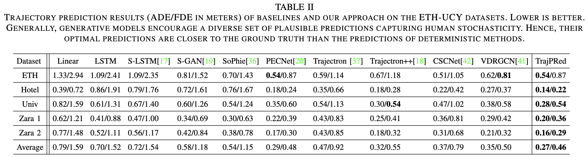
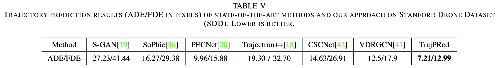

# TrajPRed: Trajectory Prediction with Region-based Relation Learning

---
This work was mainly done in the [Omni Lab for Intelligent Visual Engineering and Science (OLIVES)](https://alregib.ece.gatech.edu/) @ Georgia Tech in collaboration with the Ford Motor Company.
Feel free to check our lab's [Website](https://alregib.ece.gatech.edu/) and [GitHub](https://github.com/olivesgatech) for other interesting work!!!
[](https://alregib.ece.gatech.edu/)

---
C. Zhou, G. AlRegib, A. Parchami, and K. Singh, “TrajPRed: Trajectory Prediction with Region-based Relation Learning,” in *IEEE Transactions on Intelligent Transportation Systems (T-ITS)*, Mar. 4, 2024.

<p align="center">

</p>

### Abstract

Forecasting human trajectories in traffic scenes is critical for safety within mixed or fully autonomous systems. Human future trajectories are driven by two major stimuli, social interactions, and stochastic goals. Thus, reliable forecasting needs to capture these two stimuli. Edge-based relation modeling represents social interactions using pairwise correlations from precise individual states. Nevertheless, edge-based relations can be vulnerable under perturbations. To alleviate these issues, we propose a region-based relation learning paradigm that models social interactions via region-wise dynamics of joint states, i.e., the changes in the density of crowds. In particular, region-wise agent joint information is encoded within convolutional feature grids. Social relations are modeled by relating the temporal changes of local joint information from a global perspective. We show that region-based relations are less susceptible to perturbations. In order to account for the stochastic individual goals, we exploit a conditional variational autoencoder to realize multi-goal estimation and diverse future prediction. Specifically, we perform variational inference via the latent distribution, which is conditioned on the correlation between input states and associated target goals. Sampling from the latent distribution enables the framework to reliably capture the stochastic behavior in test data. We integrate multi-goal estimation and region-based relation learning to model the two stimuli, social interactions, and stochastic goals, in a prediction framework. We evaluate our framework on the ETH-UCY dataset and Stanford Drone Dataset (SDD). We show that diverse prediction benefits from region-based relation learning. The predicted intermediate location distributions better fit the ground truth when incorporating the relation module. Our framework outperforms the state-of-the-art models on SDD by 27.61%/18.20% of ADE/FDE metrics.




---

### Usage

To train our model on ETH-UCT or SDD, please check the scripts under [`scripts/run_TrajPRed_CVAE/`](scripts/run_TrajPRed_CVAE/).

For example, run the following bash script to train our TrajPRed on SDD.
```
scripts/run_TrajPRed_CVAE/run_TrajPRed_re_cvae_sdd.sh
```

---
### Acknowledgments
This work was mainly done in [OLIVES@GT](https://alregib.ece.gatech.edu/) with the guidance of Prof. [Ghassan AlRegib](https://www.linkedin.com/in/ghassan-alregib-0602131), and the collaboration with the [Ford Motor Company](https://www.ford.com/). 

---
### Contact
[Chen Zhou](https://www.linkedin.com/in/czhou88) <br>
chen DOT zhou AT gatech DOT edu <br>
[](https://alregib.ece.gatech.edu/)
